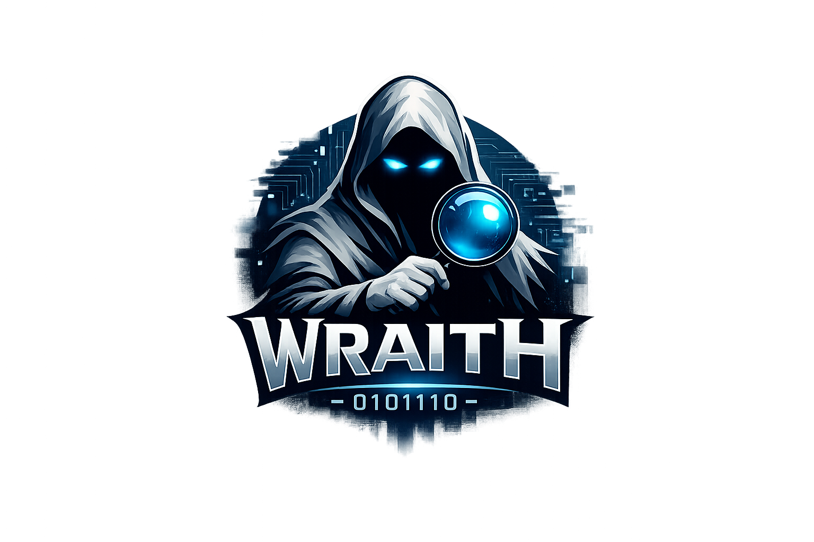

<div align="center">
  

  <h1>wraith</h1>
  <p><strong>Red team session intelligence. Capture everything. Miss nothing.</strong></p>

  <p>
    
    
    
    
  </p>
</div>

---

Wraith wraps your shell in a silent PTY layer — no prefixes, no hotkeys, no broken flow. Every keystroke and output event is timestamped and written to a local SQLite database. When you're done, an AI synthesis pipeline reads the session, clusters activity by target and phase, maps findings to MITRE ATT&CK techniques, and drops them into a terminal TUI for operator review.

Approve what's accurate. Edit what needs polish. Export when you're ready. That's it.

## How it works

```
wraith                          ← transparent PTY wrapper, invisible to your tools
  ↓
~/.wraith/sessions/<id>.db      ← every keystroke + output, timestamped, SQLite

wraith review                   ← end of session
  ↓
AI synthesis pipeline
  → extract command/output pairs from input stream
  → cluster into phases (recon / initial access / lateral / privesc / exfil)
  → build structured prompt with MITRE ATT&CK context
  → call Anthropic or OpenAI
  → parse findings: title · severity · technique · asset · CVE · CWE · CVSS · narrative
  ↓
Bubbletea TUI
  → review · approve · edit · discard · merge
  ↓
wraith export
  → report.json  (structured, engagement-tagged, multi-operator ready)
  → report.md    (markdown narrative)
```

## Install

```bash
go install github.com/jallphin/wraith/cmd/wraith@latest
```

Or build from source:

```bash
git clone https://github.com/jallphin/wraith.git
cd wraith
go build ./cmd/wraith/
```

Requires Go 1.21+. Single static binary, no runtime dependencies.

## Config

On first run, wraith creates `~/.wraith/config.toml`:

```toml
[engagement]
id = "acme-corp-2024"       # shared across operators on same engagement
client = "Acme Corp"
start_date = "2024-01-15"
scope = ["10.10.10.0/24", "*.acme.corp"]

[operator]
name = "zeeon"

[ai]
# model = "claude-sonnet-4-5"   # or gpt-4.1, gpt-5.2, etc.
# anthropic_key = ""             # falls back to ANTHROPIC_API_KEY env var
# openai_key = ""                # falls back to OPENAI_API_KEY env var
# If neither is set, wraith auto-reads your openclaw or codex CLI OAuth token.
```

## Usage

```bash
# Start a captured session — wraps your default shell
wraith

# Everything runs normally. wraith is invisible.
nmap -sV -sC 10.10.10.52
ike-scan -A expressway.htb
psk-crack --dictionary /usr/share/wordlists/rockyou.txt hash.txt
ssh ike@10.10.10.52

# Drop an operator note for anything wraith can't capture (browser, GUI, etc.)
wraith note "logged into admin panel, found /api/v1/users endpoint unauthed"

# Exit shell when done
exit

# Review session — synthesizes findings if none exist yet
wraith review

# Re-run AI synthesis on an existing session (wipes old findings)
wraith resyn

# List all sessions
wraith list

# Export approved findings
wraith export
```

## TUI Controls

| Key | Action |
|-----|--------|
| `j` / `↓` | next finding |
| `k` / `↑` | prev finding |
| `a` | approve finding |
| `d` | discard finding |
| `e` | edit narrative |
| `s` | cycle severity |
| `r` | toggle raw evidence |
| `m` | merge with next finding |
| `x` | export approved findings |
| `?` | help |
| `q` | quit |

## Finding Schema

Each finding includes:

```json
{
  "title": "IKE Pre-Shared Key Cracked via Dictionary Attack",
  "severity": "CRITICAL",
  "technique": "T1110.002 - Brute Force: Password Cracking",
  "phase": "initial_access",
  "asset": "expressway.htb (10.10.10.52)",
  "cwe": "CWE-521: Weak Password Requirements",
  "cve": null,
  "cvss_score": 9.8,
  "cvss_vector": "CVSS:3.1/AV:N/AC:L/PR:N/UI:N/S:U/C:H/I:H/A:H",
  "narrative": "The PSK hash captured from the IKEv1 Aggressive Mode handshake...",
  "evidence": [...]
}
```

## Architecture

```
wraith/
├── cmd/wraith/             — CLI entry point, subcommand dispatch
├── internal/
│   ├── capture/            — PTY interception layer
│   ├── config/             — config file + OAuth token discovery
│   ├── store/              — SQLite event + findings store
│   ├── synthesize/         — AI pipeline: extract → cluster → prompt → parse
│   └── tui/                — Bubbletea review interface + export
└── docs/
    └── logo.png
```

## Roadmap

- [x] Silent PTY capture
- [x] AI synthesis (Anthropic + OpenAI)
- [x] MITRE ATT&CK technique mapping
- [x] CVE / CWE / CVSS fields
- [x] Evidence linking (command → finding)
- [x] Operator notes (`wraith note`)
- [x] Structured JSON + Markdown export
- [x] Re-synthesis (`wraith resyn`)
- [ ] `wraith-report` — web portal for multi-operator merge + PDF export
- [ ] Built-in proxy capture (browser/GUI traffic)
- [ ] Attack path diagram export (draw.io / mermaid)
- [ ] NVD API integration for CVE → official CVSS lookup

---

<div align="center">
  <sub>Part of the <strong>Cathedral Cyber</strong> toolchain.</sub>
</div>
